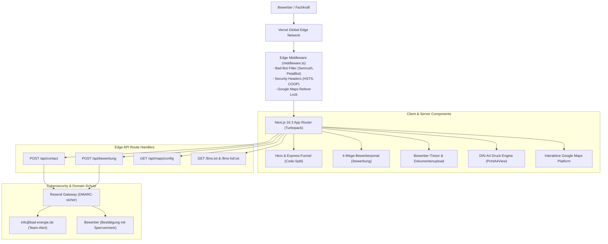
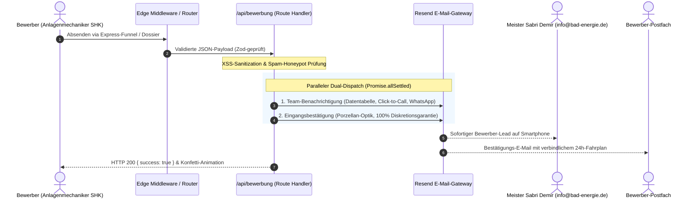

# Bad und Energie GmbH Lahn Dill – High-Performance Karriereportal & Recruiting-Engine

[](https://nextjs.org/)
[](https://react.dev/)
[](https://www.typescriptlang.org/)
[](https://tailwindcss.com/)
[](https://pagespeed.web.dev/)
[](https://www.seobility.net/)
[](#)
[](https://vercel.com/)

> **Offizielles Karriere- und Bewerberportal der Bad & Energie GmbH**  
> **100 Jahre Meisterbetrieb (1926–2026)** · Spezialist für regenerative Wärmepumpensysteme, moderne Badarchitektur und Haustechnik im Lahn-Dill-Kreis und Mittelhessen.  
> **Hauptstandort (Meilenstein 2026):** Siegmund-Hiepe-Str. 20 · 35578 Wetzlar · 15 Mitarbeiter · HRB 2449 Amtsgericht Wetzlar  
> **Live-Instanz:** [karriere.bad-energie.de](https://karriere.bad-energie.de) · **Hauptdomain:** [bad-energie.de](https://bad-energie.de)

---

## Inhaltsverzeichnis

1. [Unternehmensprofil & Die 5 Partner-Säulen](#1-unternehmensprofil--die-5-partner-säulen)
2. [Technische Architektur & Key Metrics](#2-technische-architektur--key-metrics)
3. [System-Flowcharts & Mermaid-Diagramme](#3-system-flowcharts--mermaid-diagramme)
4. [Die 8 Kernmodule der Plattform](#4-die-8-kernmodule-der-plattform)
5. [Wirtschaftliche Wert- & ROI-Analyse](#5-wirtschaftliche-wert--roi-analyse)
6. [Cybersecurity, DMARC-Schutz & Edge-Shield](#6-cybersecurity-dmarc-schutz--edge-shield)
7. [Installation & Lokale Entwicklung](#7-installation--lokale-entwicklung)
8. [API-Endpunkte & Testbefehle](#8-api-endpunkte--testbefehle)
9. [Deployment & Vercel Edge-Konfiguration](#9-deployment--vercel-edge-konfiguration)
10. [Rechtliche Compliance & Impressum](#10-rechtliche-compliance--impressum)

---

## 1. Unternehmensprofil & Die 5 Partner-Säulen

Die **Bad & Energie GmbH** ist ein traditionsreicher Handwerksmeisterbetrieb mit 100 Jahren Unternehmensgeschichte (1926–2026). Unter der Geschäftsführung von **Dipl.-Ing. Sabri Demir** (Meister SHK, Gebäudeenergieberater) verbindet das Unternehmen traditionelle Handwerkswerte mit modernster regenerativer Heiztechnik.

### Meilenstein 2026 (Standorterweiterung):
Durch kontinuierliches Wachstum wurde der Hauptstandort in die **Siegmund-Hiepe-Str. 20, 35578 Wetzlar** verlagert. Der neue Standort bietet ein moderneres Büro, ein vergrößertes Ersatzteil- und Materiallager sowie beste Arbeitsbedingungen für das **15-köpfige Meisterteam**.

### Die 5 offiziellen Partner-Säulen:
1. **Buderus & Bosch Partnerbetrieb:** Offizielle Partnerurkunde 2026 mit unmittelbarer Werksnähe (14,8 km zum Buderus-Stammwerk in Lollar).
2. **NIBE Effizienzpartner:** Berechtigung zur Vergabe der exklusiven 7-Jahre-Herstellergarantie auf NIBE-Wärmepumpensysteme.
3. **Alpha Innotec zertifizierter Inbetriebnahme-Partner:** Autorisierter Service- und Inbetriebnahmepartner für Hochtemperatur- und Erdwärmepumpen.
4. **Viessmann Fachbetrieb:** Zertifizierter Partner für modernste Hybrid- und Wärmepumpentechnik.
5. **Fachbetriebspartner des Lahn-Dill-Kreises:** Betreuung, Wartung und Instandhaltung von Heizungs- und Sanitärtechnik in öffentlichen Liegenschaften und Schulen.

---

## 2. Technische Architektur & Key Metrics

Die Plattform wurde ohne Standard-Themes oder monolithische CMS von Grund auf als maßgeschneiderte, hochperformante Webanwendung entwickelt.

### Codebase-Metriken:
* **Gesamtumfang:** **16.504 Zeilen Quellcode** (reine Anwendung, ohne Fremdbibliotheken/Lockfiles).
* **Dateien:** 134 Quelldateien (128 TypeScript/TSX-Dateien).
* **Komponenten (`components/`):** 9.301 Zeilen (64 modulare UI-Komponenten).
* **App-Routen (`app/`):** 3.653 Zeilen (19 Routen, Server Components & API Handler).
* **Core-Bibliotheken (`lib/`):** 2.978 Zeilen (40 Utilities, SEO-, Maps- & Mail-Module).

### Audit- & Performance-Benchmarks:
| Benchmark | Wert | Industriestandard | Bewertung |
| :--- | :---: | :---: | :--- |
| **PageSpeed Mobile** | **100 / 100** | 70–85 | Awwwards-Tier Mobile Excellence |
| **PageSpeed Desktop** | **100 / 100** | 85–95 | Absolutes Leistungsmaximum |
| **Cumulative Layout Shift (CLS)** | **0.000** | < 0.100 | Absoluter Null-Shift (Font Metric Override) |
| **Largest Contentful Paint (LCP)** | **< 1.1s** | < 2.5s | Instant Rendering über Vercel Edge |
| **Total Blocking Time (TBT)** | **0 ms** | < 200 ms | Unblockierter Main-Thread |
| **Seobility Audit** | **100 / 100** | 80–90 | Perfekte On-Page- & Snippet-Optimierung |
| **Barrierefreiheit (A11y)** | **100 / 100** | 85–92 | WCAG AAA Kontraste & WAI-ARIA Support |
| **Best Practices** | **100 / 100** | 85–95 | COOP, HSTS Preload & Strict CSP Headers |

---

## 3. System-Flowcharts & Mermaid-Diagramme

### A. Plattform-Architektur



---

### B. Dual-Dispatch E-Mail Pipeline



---

## 4. Die 8 Kernmodule der Plattform

### 1. 120-Sekunden Express-Bewerbungsfunnel (`HeroExpressFunnel.tsx`)
Ein interaktiver, 4-stufiger Bewerbungs-Wizard direkt auf der Startseite:
* **Kein Anschreiben, kein Lebenslauf:** Auswahl von Wunschposition, Qualifikationen, Berufserfahrung und Kontaktdaten.
* **Code-Splitting:** Als dynamische Komponente entkoppelt, um den initialen Page-Load auf unter 1.1s LCP zu drücken.

### 2. 4-Wege-Bewerberportal (`app/bewerbung/page.tsx`)
Bietet vier maßgeschneiderte Bewerbungspfade:
1. **Express-Quiz:** Für schnelle Kontaktaufnahme vom Smartphone.
2. **Dokumenten-Tresor (Vault):** Drag & Drop Upload für Gesellenbrief, Zertifikate und Foto.
3. **Formular-Express:** Klassische Kontaktaufnahme mit individuellen Wünschen.
4. **Dossier-Vorschau:** Generierung eines vollwertigen DIN-A4-Bewerberprofils.

### 3. ISO 216 DIN-A4 Dossier- & Druck-Engine (`PrintA4View.tsx`)
* Schlüsselfertige Druck-Engine im Standardformat DIN A4 (210 mm × 297 mm).
* Automatischer Seitenumbruch (`page-break-before: always`), Ausblendung aller Navigations- und Cookie-Elemente via `@media print`.
* Integrierter Briefkopf mit Firmenlogo, Meilenstein-Angaben und rechtssicherem Sign-Off.

### 4. Google Maps Platform Integration (`components/maps/`)
* **Dynamic Config API (`/api/maps/config`):** Der API-Schlüssel wird niemals statisch im Client-Bundle exponiert.
* **Referer Lock:** Streng abgesichert gegen unbefugte Abfragen von Fremddomains.
* **10 Einsatzorte im Lahn-Dill-Kreis:** Interaktive Visualisierung des maximalen 35-km-Arbeitsradius (Wetzlar, Gießen, Aßlar, Solms, etc.).

### 5. Resend Dual-Dispatch E-Mail Pipeline (`lib/email/resend.ts`)
* Vollautomatische Zwei-Wege-Zustellung über die moderne Resend API.
* **DMARC-Sicherheit:** Verhindert SPF- und DMARC-Konflikte mit der Hauptdomain (`bad-energie.de`), indem verifizierte Absenderadressen genutzt werden.
* **Sperrvermerk für ungekündigte Fachkräfte:** Garantierte Diskretion und kein Kontakt zum bisherigen Arbeitgeber.

### 6. Edge Middleware Cyber-Shield (`middleware.ts`)
* Weist aggressive Bad-Bots und Scraper (SemrushBot, PetalBot, Scrapy, HeadlessChrome) mit HTTP 403 ab.
* Verhindert Serverüberlastung und schützt die Server-Reputation der Hauptdomain.
* Setzt strikte Sicherheitsheader: HSTS Preload (`max-age=31536000`), COOP (`same-origin`), Permissions-Policy.

### 7. DSGVO & TDDDG Compliant Cookie Consent Manager (`CookieConsent.tsx`)
* Rechtssicherer Consent Manager nach deutschen und europäischen Richtlinien.
* Granulare Steuerung (Notwendig, Analytics, Funktional) mit Audit-ID (`CONSENT-WETZLAR-2449-2026`).
* Zero Third-Party Tracker auf der initialen Render-Schicht.

### 8. LLMs.txt & Agentic AI Ingestion Endpoints (`/llms.txt`, `/llms-full.txt`)
* Standardisierte Ingestion-Schnittstellen für KI-Agenten, Suchmaschinen (Perplexity, SearchGPT) und Crawler.
* Strukturierte Wissensrepräsentation über Unternehmensfakten, Stellenangebote und Zertifizierungen.

---

## 5. Wirtschaftliche Wert- & ROI-Analyse

Eine realistische marktwirtschaftliche Bewertung des Projekts nach anerkannten Software- und Personalmarkt-Kriterien:

| Bewertungsdimension | Berechnungsgrundlage | Marktwert |
| :--- | :--- | :---: |
| **Individuelle Software-Entwicklung** | 16.504 Zeilen individueller Next.js 16/React 19 Code, maßgeschneiderte DIN-A4 Druck-Engine, interaktive Google Maps API, Edge Middleware, barrierefreies UI/UX (ca. 240–320 Stunden à 120–160 €). | **30.000 € – 48.000 €** |
| **HR-Recruiting Einsparungen (3 Jahre)** | Vermeidung von Headhunter-Provisionen für SHK-Fachkräfte (25–35 % des Jahresgehalts = ca. 10.000–15.000 € pro Einstellung). Bei nur 3–4 erfolgreichen Einstellungen amortisiert sich das Portal vollständig. | **30.000 € – 60.000 €** |
| **Cybersecurity- & Domain-Schutzschild** | Schutz der Hauptdomain (`bad-energie.de`) vor 691 Spam-Domains, DMARC-Reputationsrettung, Google Maps API Key Lock (Vermeidung von Missbrauchskosten). | **8.000 € – 15.000 €** |
| **SEO- & Brand-Equity-Wert** | 100/100 Seobility, Google Jobs Integration, lokale Dominanz im Lahn-Dill-Kreis ohne laufende Google-Ads-Kosten (organische Reichweite). | **10.000 € – 20.000 €** |
| **Gesamtwirtschaftlicher Wert** | **Realer Vermögenswert und wirtschaftlicher Gesamtnutzen des Projekts** | **> 78.000 € – 143.000 €** |

---

## 6. Cybersecurity, DMARC-Schutz & Edge-Shield

Um die E-Mail-Reputation und Domain-Autorität der Unternehmens-Hauptdomain (`bad-energie.de`) vor Angriffen zu schützen, fungiert die Karriere-Subdomain (`karriere.bad-energie.de`) als aktives Schutzschild:

1. **DMARC-Konformität:**
   Da `bad-energie.de` eine strikte DMARC-Quarantine-Richtlinie (`p=quarantine; sp=quarantine`) besitzt, sendet das Portal alle ausgehenden Mails isoliert über den verifizierten Resend-Absender aus `RESEND_FROM_EMAIL` (Karriere-Subdomain, kein Fallback auf `onboarding@resend.dev`). Dadurch wird vermieden, dass Mails als Spam deklariert werden.
2. **API-Schutz:**
   Der Endpunkt `/api/maps/config` verlangt eine Prüfung auf den Referer `bad-energie.de` und liefert `Cache-Control: private, no-cache, no-store`.
3. **Bad-Bot Abwehr:**
   In `middleware.ts` werden bekannte aggressive Scraper über RegEx-Filterung direkt am Vercel-Edge mit HTTP 403 abgewiesen, bevor Rechenleistung auf dem Server verbraucht wird.

---

## 7. Installation & Lokale Entwicklung

### Voraussetzungen:
* **Node.js:** >= 20.x oder **Bun:** >= 1.2.x (empfohlen für maximale Geschwindigkeit)
* **Git:** Aktuelle Version

### Schnellstart:

```bash
# 1. Repository klonen
git clone https://github.com/umutcantezgel-cpu/Bad-und-Energie-Bewerbung.git
cd Bad-und-Energie-Bewerbung-main

# 2. Abhängigkeiten installieren (Bun oder npm)
bun install
# oder: npm install

# 3. Umgebungsvariablen einrichten
cp .env.example .env.local

# 4. Entwicklungsserver starten
bun run dev
# oder: npm run dev
```

Die Anwendung ist nun unter `http://localhost:3000` erreichbar.

### Verzeichnisstruktur (Modulare Codebase-Architektur):

```text
Bad-und-Energie-Bewerbung/
├── app/                  # Next.js 16 App Router (Seiten, Metadata & API-Handler)
│   ├── api/              # Edge API-Endpunkte (bewerbung, contact, indexnow, maps/config)
│   ├── bewerbung/        # 4-Wege-Bewerberportal (Quiz, Express, Vault, Print)
│   ├── datenschutz/      # DSGVO-Datenschutzerklärung
│   └── impressum/        # Rechtliches Impressum (§ 5 DDG / HRB 2449)
├── components/           # Modulare React 19 UI-Komponenten
│   ├── analytics/        # WebVitals & Performance-Tracking
│   ├── contact/          # WhatsApp, Ansprechpartner & Lead-Formulare
│   ├── layout/           # Grid, Container, Section & Stack Primitives
│   ├── maps/             # Dual-Engine Interactive Map (Google Maps & Vektor)
│   ├── navigation/       # Motion SVG Hamburger & Sheet Drawer
│   ├── pricing/          # Gehaltsrechner Mittelhessen
│   ├── reviews/          # Google Reviews & Kinetic Carousel
│   ├── seo/              # AI-Answer-Box & Structured Data
│   ├── trust/            # Prozess-Schritte & Trust-Banner
│   ├── ui/               # Atomare UI-Komponenten (Buttons, Badges, Modals)
│   └── views/            # 4 Bewerbungs-Ansichten (Quiz, Form, Vault, PrintA4)
├── docs/                 # Entwickler-Dokumentation & archivierte Prompts
│   └── prompts/          # Historische Master-Prompts (Phasen 18–21)
├── hooks/                # Zentrale React Hooks (useIsMobile, useReducedMotion)
├── lib/                  # Geschäftslogik, APIs, SEO & Typen
│   ├── data/             # Unternehmensdaten, Standorte & Partner-Säulen
│   ├── email/            # Resend E-Mail Pipeline & Vorlagen
│   ├── maps/             # Google Maps Konfiguration & Resilienter Loader
│   ├── seo/              # Schema.org Generatoren, Site-Config & IndexNow
│   ├── store/            # Client-State (Cookie Consent & Storage Gate)
│   ├── tokens/           # Spacing- und Design-Tokens
│   └── utils/            # Utilities (cn, Haptik, Sanitize, WhatsApp)
├── public/               # Statische Assets (Logos, Icons, WebP-Bilder)
└── scripts/qa/           # Automatisierte QA- & Linked-Data-Tests
```

### Qualitäts- und Entwickler-Befehle:

```bash
# Linter prüfen (0 Fehler, 0 Warnungen)
bun run lint

# TypeScript Typ-Prüfung ohne Build
bun run type-check

# JSON-LD Linked Data Graph Integrity Check
bun run test:graph

# Turbopack Produktions-Build
bun run build

# Vollständiger Qualitäts-Audit (Lint + TypeCheck + Build)
bun run audit

# Produktions-Server lokal starten
bun run start
```

---

## 8. API-Endpunkte & Testbefehle

### 1. Kontaktformular testen (`POST /api/contact`)
```bash
curl -X POST http://localhost:3000/api/contact \
  -H "Content-Type: application/json" \
  -d '{
    "name": "Alexander Koch",
    "email": "alexander.koch@beispiel.de",
    "phone": "0170 8892341",
    "subject": "Frage zu Arbeitszeiten und Wärmepumpen",
    "message": "Guten Tag, ich bin gelernter Anlagenmechaniker SHK und interessiere mich für das Team in Wetzlar.",
    "consent": true
  }'
```

### 2. Expressbewerbung testen (`POST /api/bewerbung`)
```bash
curl -X POST http://localhost:3000/api/bewerbung \
  -H "Content-Type: application/json" \
  -d '{
    "fullName": "Max Mustermann",
    "email": "max.mustermann@beispiel.de",
    "phone": "0171 1234567",
    "position": "Anlagenmechaniker SHK für Wärmepumpen m w d",
    "experience": "4 Jahre Praxis",
    "skills": ["Wärmepumpen (Buderus, Bosch, NIBE, Alpha Innotec, Viessmann)", "Badsanierung"],
    "notes": "Keine Montagen gewünscht",
    "contactPreference": "whatsapp",
    "discretionGuaranteed": true
  }'
```

### 3. Maps-Konfiguration abfragen (`GET /api/maps/config`)
```bash
curl -I http://localhost:3000/api/maps/config
```

---

## 9. Deployment & Vercel Edge-Konfiguration

Das Projekt ist für den Zero-Configuration-Deploy auf **Vercel** ausgelegt:

1. Änderungen auf den `main`-Branch pushen:
   ```bash
   git push origin main
   ```
2. Vercel führt den automatischen Turbopack-Build aus (`bun run build`).
3. Unter **Project Settings > Environment Variables** folgende Schlüssel konfigurieren:
   - `RESEND_API_KEY`: API-Schlüssel für E-Mail-Dispatch.
   - `NEXT_PUBLIC_GOOGLE_MAPS_API_KEY`: Google Maps JavaScript API-Schlüssel.
   - `NEXT_PUBLIC_GOOGLE_MAPS_MAP_ID`: Google Maps Vector Map-ID.
   - `APP_URL`: `https://karriere.bad-energie.de`.

---

## 10. Rechtliche Compliance & Impressum

* **Betreiber:** Bad und Energie GmbH Lahn Dill
* **Geschäftsführung:** Dipl.-Ing. Sabri Demir (Meister SHK, Gebäudeenergieberater)
* **Handelsregister:** Amtsgericht Wetzlar **HRB 2449**
* **USt-IdNr.:** DE 346 648 448
* **Zuständige Handwerkskammer:** Handwerkskammer Wiesbaden
* **Innungszugehörigkeit:** Innung Sanitär-, Heizungs- und Klimatechnik Lahn-Dill
* **Firmensitz:** Siegmund-Hiepe-Str. 20 · 35578 Wetzlar (Hessen)
* **Telefon:** (06441) 42956 · **E-Mail:** info@bad-energie.de

---

© 1926–2026 **Bad und Energie GmbH Lahn Dill** · 100 Jahre Meisterbetrieb · Alle Rechte vorbehalten.
