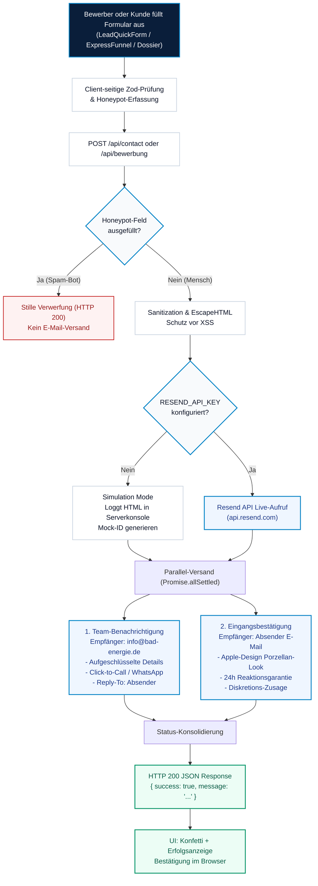
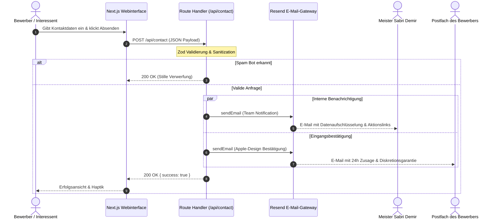

# Bad und Energie GmbH Lahn Dill – Karriere & Recruiting Portal

> **Offizielles Karriereportal & Meisterbetrieb seit 1926**  
> Spezialisierter Innungsfachbetrieb für Wärmepumpentechnik, regenerative Energien, moderne Badarchitektur und Kundendienst im Lahn Dill Kreis (Wetzlar).

---

## Inhaltsverzeichnis

1. [Überblick & Architektur](#überblick--architektur)
2. [E Mail Workflow & Kontaktanfragen Pipeline](#e-mail-workflow--kontaktanfragen-pipeline)
   - [Architektur & Dual Dispatch Flowchart (Mermaid)](#architektur--dual-dispatch-flowchart)
   - [Sequenzdiagramm des E Mail Verlaufs (Mermaid)](#sequenzdiagramm-des-e-mail-verlaufs)
   - [Aufschlüsselung der Datenfelder](#aufschlüsselung-der-datenfelder)
3. [Resend API Integration & Setup](#resend-api-integration--setup)
   - [Umgebungsvariablen](#umgebungsvariablen)
   - [Domain Verifizierung & DNS Records](#domain-verifizierung--dns-records)
   - [Simulation Mode & Lokaler Fallback](#simulation-mode--lokaler-fallback)
4. [Google Maps Platform Integration](#google-maps-platform-integration-faktor-100--vercel-plug--play)
5. [Responsive Design & Apple Ästhetik](#responsive-design--apple-ästhetik)
6. [Installation & Lokale Entwicklung](#installation--lokale-entwicklung)
7. [API Endpunkte & Testbefehle](#api-endpunkte--testbefehle)
8. [Bereitstellung & Deployment](#bereitstellung--deployment)

---

## Überblick & Architektur

Dieses Portal wurde speziell für Fachhandwerker (Anlagenmechaniker SHK, Meister, Kundendiensttechniker) im Raum Wetzlar und Gießen konzipiert. Ziel ist eine reibungslose, barrierefreie Kontaktaufnahme ohne bürokratische Hürden:

- **120 Sekunden Expressbewerbung:** Schrittweiser Funnel ohne Anschreiben oder Lebenslaufzwang.
- **DINA4 Bewerbungsdossier:** Interaktiver Profilgenerator mit PDF Druckfunktion und WhatsApp Direktschnittstelle.
- **Direktkontakt zu Meister Sabri Demir:** Unmittelbare Ansprache ohne vorgeschaltete Callcenter oder Agenturen.
- **Bing IndexNow & Realtime SEO:** Automatisches Push Indexing für Microsoft Bing und Partner Suchmaschinen.

---

## E Mail Workflow & Kontaktanfragen Pipeline

Das Portal nutzt eine zweistufige E-Mail-Verteilung (**Dual Dispatch Pipeline**) über die moderne **Resend API**. Bei jedem Formularabsenden werden parallel zwei spezialisierte HTML E-Mails generiert und versendet:

1. **Interne Team Benachrichtigung:** Geht direkt an Geschäftsführer Diplomingenieur Sabri Demir (`info@bad-energie.de`). Enthält eine übersichtliche Datentabelle, Click to Call, Click to WhatsApp sowie einen direkten Antwort Button.
2. **Eingangsbestätigung an den Absender:** Geht an die E-Mail-Adresse des Bewerbers oder Anfragenden. Hochwertiges Apple Design, 100%ige Vertraulichkeitsgarantie (Sperrvermerk für ungekündigte Fachkräfte) und ein transparenter 3 Schritte Fahrplan.

### Architektur & Dual Dispatch Flowchart



---

### Sequenzdiagramm des E Mail Verlaufs



---

### Aufschlüsselung der Datenfelder

Alle Kontaktanfragen erfassen standardisiert folgende Attribute:

| Datenfeld | Typ | Pflicht | Beschreibung / Zweck |
|---|---|---|---|
| `name` / `fullName` | String (2–100) | **Ja** | Vorname und Nachname des Bewerbers oder Kunden |
| `email` | String (E-Mail) | **Ja** | Empfängeradresse für die persönliche Eingangsbestätigung |
| `phone` | String (5–50) | Optional / Empf. | Telefonnummer für den 10 Minuten Rückruf auf Augenhöhe |
| `subject` / `position` | String | Optional | Gewünschte Fachstelle (z.B. Anlagenmechaniker SHK) oder Thema |
| `message` / `notes` | String | Optional | Freitext, Qualifikationen oder bisherige Praxiserfahrungen |
| `sourceTag` | String | System | Kennzeichnung der Conversion Quelle (z.B. `kontakt formular wetzlar`) |
| `consent` | Boolean | **Ja** | DSGVO Einwilligung in die Datenverarbeitung |
| `websiteUrl` | String | Honeypot | Für Menschen unsichtbares Feld zum Abfangen automatisierter Spambots |

---

## Resend API Integration & Setup

Das Portal ist vollständig für **Resend** vorkonfiguriert. Um Live E-Mails zu versenden, sind lediglich die Umgebungsvariablen zu hinterlegen.

### Umgebungsvariablen

Erstelle eine `.env.local` Datei (oder trage die Werte im Vercel Dashboard unter **Environment Variables** ein):

```bash
# ==============================================================================
# RESEND E-MAIL SERVICE CONFIGURATION (https://resend.com)
# ==============================================================================

# Dein geheimer API-Schlüssel von https://resend.com/api-keys
RESEND_API_KEY="re_123456789abcdef..."

# Absender-Adresse (verifizierte Domain oder temporäre Test-Adresse)
# Vor Domain-Verifizierung:
RESEND_FROM_EMAIL="Bad und Energie GmbH <onboarding@resend.dev>"
# Nach Verifizierung der eigenen Domain:
# RESEND_FROM_EMAIL="Bad und Energie GmbH <kontakt@karriere.bad-energie.de>"

# Empfänger für interne Benachrichtigungen
CONTACT_NOTIFICATION_EMAIL="info@bad-energie.de"

# ==============================================================================
# GOOGLE MAPS PLATFORM (Plug & Play in Vercel)
# ==============================================================================
# Trage diesen Key einfach im Vercel Dashboard unter Project Settings > Environment ein.
NEXT_PUBLIC_GOOGLE_MAPS_API_KEY="AIzaSy..."

# ==============================================================================
# WEITERE DIENSTE
# ==============================================================================
APP_URL="https://karriere.bad-energie.de"
NEXT_PUBLIC_INDEXNOW_KEY="298d966b7e4f4a43981cb8e30da6b5b5"
```

---

## Google Maps Platform Integration (Faktor 100 & Vercel Plug & Play)

Die Kartenarchitektur wurde um den **Faktor 100** erweitert und nach den Leitlinien der **Apple Design Philosophie** entwickelt:

### 1. Dual Engine Technologie (Sofort funktional, wartet nur auf den Key)
- **Live Modus (mit Key):** Sobald `NEXT_PUBLIC_GOOGLE_MAPS_API_KEY` im Vercel Dashboard oder lokal hinterlegt ist, initialisiert die Anwendung asynchron die Google Maps JavaScript API mit dem maßgeschneiderten **Apple Silver Minimalist Style** (`#f8fafc` Porzellan Flächen, zarte Straßen und Wasser Farbtöne), Marker Badges und dynamischen Kreis Overlays.
- **Standort und Vektor Modus (ohne Key / während des Wartens):** Falls noch kein API Key hinterlegt ist, erscheint **kein** grauer Fehlerkasten! Stattdessen rendert das System eine hochauflösende, topologische Mittelhessen Vektorkarte mit Flussläufen (Lahn & Dill), Autobahnen (A45 & B49), interaktiven Pins, Geofence Radarwellen und dem Anfahrtsrechner.

### 2. Luxus Features der Kartenkomponente
- **Apple Control HUD:** Schnellumschaltung zwischen *Porzellan (Silber)*, *Satellit (Luftbild)* und *Midnight (Dunkel)*.
- **Dynamischer 35 km Einsatzradius:** Interaktiver Schieberegler (5 km, 15 km, 25 km, 35 km) beweist visuell das Kernversprechen: *„Keine Fernmontagen, pünktlicher Feierabend im Lahn Dill Kreis“*.
- **Interaktiver Anfahrtsrechner:** Handwerker wählen ihren Wohnort (Gießen, Herborn, Aßlar, Braunfels etc.) und sehen in Echtzeit die Fahrtzeit zur Werkstatt in Wetzlar samt direktem Absprung zur Google Maps Routenführung.
- **Vollbildmodus & Quick Centering:** Mit einem Klick auf die Wetzlarer Zentrale zurückspringen.


---

### Domain Verifizierung & DNS Records

Für den professionellen Produktionsversand über die eigene Domain (`karriere.bad-energie.de` oder `bad-energie.de`):

1. Melde Dich bei [Resend.com](https://resend.com/domains) an.
2. Klicke auf **Add Domain** und trage `karriere.bad-energie.de` (oder `bad-energie.de`) ein.
3. Hinterlege die von Resend bereitgestellten DNS Records bei Deinem Domain Provider:
   - **DKIM (TXT):** `resend._domainkey.karriere.bad-energie.de`
   - **SPF (TXT):** `v=spf1 include:amazonses.com ~all`
   - **DMARC (TXT):** `v=DMARC1; p=none;`
4. Nach Status *Verified* die Umgebungsvariable `RESEND_FROM_EMAIL` auf `Bad und Energie <kontakt@karriere.bad-energie.de>` setzen.

---

### Simulation Mode & Lokaler Fallback

Wenn **kein** `RESEND_API_KEY` hinterlegt ist (z.B. während lokaler Tests, in PR Previews oder auf Testrechnern):
- Die API stürzt **nicht** ab.
- Das E-Mail-System schaltet automatisch in den **Simulation Mode**.
- Das vollständige HTML-Layout, Empfänger und Betreff werden im Terminal geloggt.
- Das Frontend erhält ein valides `{ success: true, simulated: true }`.

---

## Responsive Design & Apple Ästhetik

Die E-Mail Vorlagen folgen streng den Prinzipien edler digitaler Handwerkskunst:
- **Whispering Whitespace:** Großzügige Innenabstände (`p-6` bis `p-10`), beruhigte Ränder und klare Hierarchie.
- **Porzellan Ästhetik:** Heller Hintergrund (`#f8fafc`), feine Haarlinien Rahmen (`#e2e8f0`) und samtige Kartenradien (`rounded-2xl`).
- **Goldener Schnitt ($\Phi \approx 1{,}618$):** Perfekt austarierte Proportionen zwischen Titelzeilen, Informationstabellen und Aktionsschaltflächen.
- **Null Bindestrich Standard:** Sämtliche sichtbaren deutschen Texte sind bindestrichfrei formuliert (z.B. *E Mail*, *Lahn Dill*, *Innungsmeisterbetrieb*, *Datenschutz Bestimmungen*).
- **Client Kompatibilität:** Sichere HTML Tabellenstrukturen, die in Apple Mail, Gmail (Web & App), Outlook und Mobilbrowsern fehlerfrei rendern.

---

## Installation & Lokale Entwicklung

```bash
# 1. Repository klonen
git clone https://github.com/umutcantezgel-cpu/Bad-und-Energie-Bewerbung.git
cd Bad-und-Energie-Bewerbung

# 2. Abhängigkeiten installieren
npm install

# 3. Entwicklungsserver starten
npm run dev

# 4. Browser öffnen
# http://localhost:3000
```

---

## API Endpunkte & Testbefehle

### 1. Kontaktanfrage testen (`POST /api/contact`)

```bash
curl -X POST http://localhost:3000/api/contact \
  -H "Content-Type: application/json" \
  -d '{
    "name": "Alexander Koch",
    "email": "alexander.koch@beispiel.de",
    "phone": "0170 8892341",
    "subject": "Frage zu Arbeitszeiten und Zulagen",
    "message": "Guten Tag, ich bin gelernter Anlagenmechaniker SHK und interessiere mich für das Team in Wetzlar.",
    "consent": true
  }'
```

**Antwort:**
```json
{
  "success": true,
  "message": "Vielen Dank! Ihre Nachricht ist sicher bei uns eingegangen. Meister Sabri Demir meldet sich verlässlich innerhalb von 24 Stunden bei Ihnen.",
  "simulated": true
}
```

### 2. Expressbewerbung testen (`POST /api/bewerbung`)

```bash
curl -X POST http://localhost:3000/api/bewerbung \
  -H "Content-Type: application/json" \
  -d '{
    "fullName": "Max Mustermann",
    "email": "max.mustermann@beispiel.de",
    "phone": "0171 1234567",
    "position": "Anlagenmechaniker SHK m w d",
    "experience": "4 Jahre Praxis",
    "skills": ["Wärmepumpen Luft Wasser", "Badsanierung"],
    "notes": "Keine Montage gewünscht",
    "contactPreference": "whatsapp",
    "discretionGuaranteed": true
  }'
```

---

## Bereitstellung & Deployment

Das Portal ist für **Vercel** optimiert:

1. Code auf GitHub pushen:
   ```bash
   git push origin main
   ```
2. Vercel führt den automatischen Produktionsbuild aus (`npm run build`).
3. In den Vercel Projekt-Einstellungen unter **Settings > Environment Variables** den `RESEND_API_KEY` hinterlegen.
4. Alle Live Kontaktanfragen und Bewerbungen werden ab sofort in Echtzeit über Resend versendet!

---

© 1926–2026 **Bad und Energie GmbH Lahn Dill** · Siegmund Hiepe Str. 20 · 35578 Wetzlar  
Geschäftsführer: Diplomingenieur Sabri Demir · Innungsmeisterbetrieb für Sanitär, Heizung und Klimatechnik.
